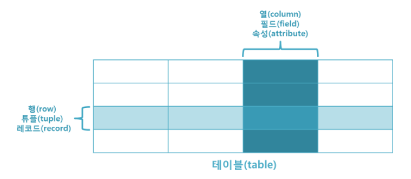

# MySQL

### MySQL이란?
---

**MySQL**이란 전세계적으로 가장 널리 사용하는 오픈 소스 데이터베이스(Database)로, AB사가 개발하고 배포/판매하는 DB이다. 
표준 데이터베이스 질의 언어인 SQL(Structure Query Language)을 사용하는 관계형 데이터베이스 관리 시스템(RDBMS, Relational DataBase Management System)으로,  매우 빠르고, 유연하며 사용하기 쉬운 장점이 있다. 
다중사용자, 다중 쓰레드를 지원하고, C, C++, Eiffel, 자바, 펄, PHP, Pyton 스크립트 등을 위한 응용프로그램 인터페이스(API)를 제공한다. 거기에 더해 유닉스나 리눅스, Windows 등 다양한 운영체제에서 사용할 수 있다. 

### Database란?
---

어느 한 조직의 여러 응용 시스템이 공유할 수 있도록 통합, 저장된 운영 데이터의 집합을 의미한다. 

### Database의 특징
---

데이터베이스는 질의에 대한 실시간 처리 및 응답을 처리할 수 있도록 실시간 접근과 삽입, 삭제, 갱신을 통해 현재의 데이터를 동적으로 유지할 수 있는 계속적인 변화를 제공하며, 여러 사용자가 동시에 공용할 수 있는 동시에 공유와 위치나 주소가 아닌 내용, 즉 값에 따라 참조할 수 있는 내용에 의한 참조의 특징을 지니고 있다.

### Database의 구성 요소
---

데이터에서는 어떤 목적을 가지고 하나의 테이블을 정의한다. 테이블을 이용할 경우 편리성을 제공하기 위해서는 필드를 상세히 정의하는 것이 좋다.

### 데이터베이스 관리 시스템이란?
---

DBMS는 응용 프로그램과 데이터의 중재자로서 모든 응용 프로그램들이 데이터베이스를 공유할 수 있도록 관리해 주는 소프트웨어 시스템이다. 목적은 데이터의 독립성을 제공하는 것이다. 
데이터의 독립성에는 응용 프로그램에 영향을 주지 않고, 데이터베이스의 논리적인 구조를 변경시킬 수 있는 물리적 데이터의 독립성이 있다. MySQL도 DBMS의 한종류이다.

### MySQL 데이터베이스의 특징
---

1. 대소문자를 구분하지 않는다.
2. 구문 뒤에 세미콜론(;)을 붙인다.
3. 주석은 두 개의 하이픈(--)과 한칸의 공백이다.
4. 컬럼은 이름, 데이터 타입, 제약사항으로 이루어진다.